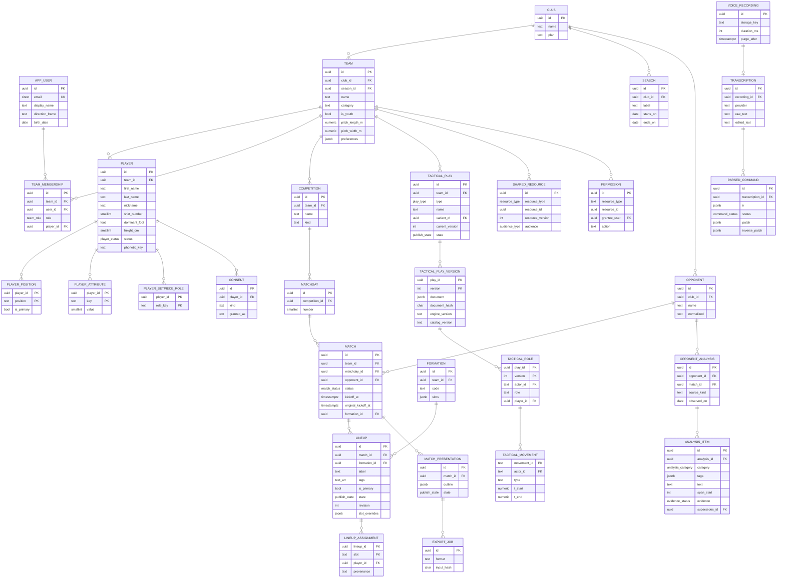

# Diagrama entidad‑relación (detalle)

Fuente de verdad: [`../db/schema.sql`](../db/schema.sql). Atributos principales.

```mermaid
erDiagram
  APP_USER { uuid id PK
    citext email UK
    text display_name
    text direction_frame
    date birth_date }
  CLUB { uuid id PK
    text name
    text plan }
  SEASON { uuid id PK
    uuid club_id FK
    text label
    date starts_on
    date ends_on }
  TEAM { uuid id PK
    uuid club_id FK
    uuid season_id FK
    text name
    text category
    bool is_youth
    numeric pitch_length_m
    numeric pitch_width_m
    jsonb preferences }
  TEAM_MEMBERSHIP { uuid id PK
    uuid team_id FK
    uuid user_id FK
    team_role role
    uuid player_id FK }
  PLAYER { uuid id PK
    uuid team_id FK
    text first_name
    text last_name
    text nickname
    smallint shirt_number
    foot dominant_foot
    smallint height_cm
    player_status status
    text phonetic_key }
  PLAYER_POSITION { uuid player_id PK
    text position PK
    bool is_primary }
  PLAYER_ATTRIBUTE { uuid player_id PK
    text key PK
    smallint value }
  PLAYER_SETPIECE_ROLE { uuid player_id PK
    text role_key PK }
  COMPETITION { uuid id PK
    uuid team_id FK
    text name
    text kind }
  MATCHDAY { uuid id PK
    uuid competition_id FK
    smallint number }
  OPPONENT { uuid id PK
    uuid club_id FK
    text name
    text normalized }
  MATCH { uuid id PK
    uuid team_id FK
    uuid matchday_id FK
    uuid opponent_id FK
    match_status status
    timestamptz kickoff_at
    timestamptz original_kickoff_at
    uuid formation_id FK }
  FORMATION { uuid id PK
    uuid team_id FK
    text code
    jsonb slots }
  LINEUP { uuid id PK
    uuid match_id FK
    uuid formation_id FK
    text label
    text_arr tags
    bool is_primary
    publish_state state
    int revision
    jsonb slot_overrides }
  LINEUP_ASSIGNMENT { uuid lineup_id PK
    text slot PK
    uuid player_id FK
    text provenance }
  TACTICAL_PLAY { uuid id PK
    uuid team_id FK
    play_type type
    text name
    uuid variant_of FK
    int current_version
    publish_state state }
  TACTICAL_PLAY_VERSION { uuid play_id PK
    int version PK
    jsonb document
    char document_hash
    text engine_version
    text catalog_version }
  TACTICAL_ROLE { uuid play_id PK
    int version PK
    text actor_id PK
    text role
    uuid player_id FK }
  TACTICAL_MOVEMENT { text movement_id PK
    text actor_id FK
    text type
    numeric t_start
    numeric t_end }
  VOICE_RECORDING { uuid id PK
    text storage_key
    int duration_ms
    timestamptz purge_after }
  TRANSCRIPTION { uuid id PK
    uuid recording_id FK
    text provider
    text raw_text
    text edited_text }
  PARSED_COMMAND { uuid id PK
    uuid transcription_id FK
    jsonb ir
    command_status status
    jsonb patch
    jsonb inverse_patch }
  OPPONENT_ANALYSIS { uuid id PK
    uuid opponent_id FK
    uuid match_id FK
    text source_kind
    date observed_on }
  ANALYSIS_ITEM { uuid id PK
    uuid analysis_id FK
    analysis_category category
    jsonb tags
    text text
    int span_start
    evidence_status evidence
    uuid supersedes_id FK }
  MATCH_PRESENTATION { uuid id PK
    uuid match_id FK
    jsonb outline
    publish_state state }
  EXPORT_JOB { uuid id PK
    text format
    char input_hash }
  SHARED_RESOURCE { uuid id PK
    resource_type resource_type
    uuid resource_id
    int resource_version
    audience_type audience }
  PERMISSION { uuid id PK
    text resource_type
    uuid resource_id
    uuid grantee_user FK
    text action }
  CONSENT { uuid id PK
    uuid player_id FK
    text kind
    text granted_as }

  CLUB ||--o{ TEAM : ""
  CLUB ||--o{ SEASON : ""
  CLUB ||--o{ OPPONENT : ""
  TEAM ||--o{ PLAYER : ""
  TEAM ||--o{ TEAM_MEMBERSHIP : ""
  APP_USER ||--o{ TEAM_MEMBERSHIP : ""
  PLAYER ||--o{ PLAYER_POSITION : ""
  PLAYER ||--o{ PLAYER_ATTRIBUTE : ""
  PLAYER ||--o{ PLAYER_SETPIECE_ROLE : ""
  PLAYER ||--o{ CONSENT : ""
  TEAM ||--o{ COMPETITION : ""
  COMPETITION ||--o{ MATCHDAY : ""
  MATCHDAY ||--o{ MATCH : ""
  OPPONENT ||--o{ MATCH : ""
  MATCH ||--o{ LINEUP : ""
  FORMATION ||--o{ LINEUP : ""
  LINEUP ||--o{ LINEUP_ASSIGNMENT : ""
  TEAM ||--o{ TACTICAL_PLAY : ""
  TACTICAL_PLAY ||--o{ TACTICAL_PLAY_VERSION : ""
  TACTICAL_PLAY_VERSION ||--o{ TACTICAL_ROLE : ""
  TACTICAL_ROLE ||--o{ TACTICAL_MOVEMENT : ""
  VOICE_RECORDING ||--o| TRANSCRIPTION : ""
  TRANSCRIPTION ||--o{ PARSED_COMMAND : ""
  OPPONENT ||--o{ OPPONENT_ANALYSIS : ""
  OPPONENT_ANALYSIS ||--o{ ANALYSIS_ITEM : ""
  MATCH ||--o{ MATCH_PRESENTATION : ""
  MATCH_PRESENTATION ||--o{ EXPORT_JOB : ""
  TEAM ||--o{ SHARED_RESOURCE : ""
  TEAM ||--o{ PERMISSION : ""
```
