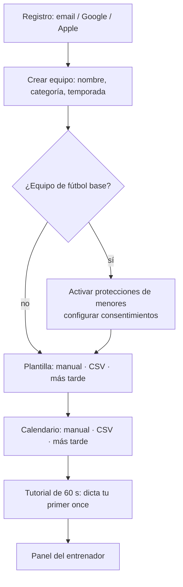
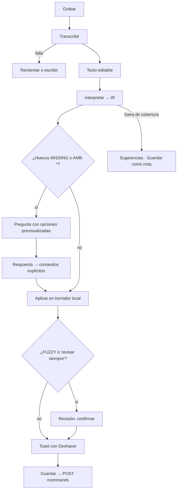
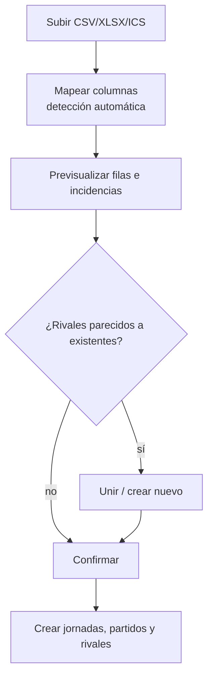
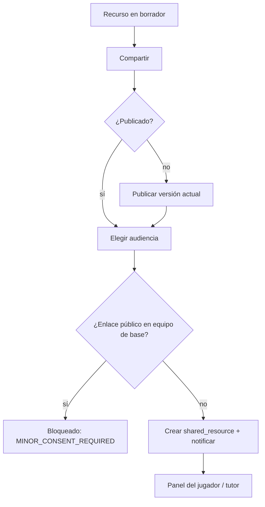

# Diagramas de flujo

## Alta inicial (onboarding)

```mermaid
flowchart TD
  A[Registro: email / Google / Apple] --> B[Crear equipo: nombre, categoría, temporada]
  B --> C{¿Equipo de fútbol base?}
  C -- sí --> C1[Activar protecciones de menores<br/>configurar consentimientos]
  C -- no --> D
  C1 --> D[Plantilla: manual · CSV · más tarde]
  D --> E[Calendario: manual · CSV · más tarde]
  E --> F[Tutorial de 60 s: dicta tu primer once]
  F --> G[Panel del entrenador]
```

## Voz: de la grabación al cambio aplicado

```mermaid
flowchart TD
  R[Grabar] --> T[Transcribir]
  T -->|falla| T2[Reintentar o escribir]
  T --> X[Texto editable]
  X --> P[Interpretar → IR]
  P --> Q{¿Huecos MISSING o AMB-*?}
  Q -- sí --> K[Pregunta con opciones previsualizadas]
  K --> P2[Respuesta → comandos explícitos] --> E
  Q -- no --> E[Aplicar en borrador local]
  E --> F{¿FUZZY o 'revisar siempre'?}
  F -- sí --> RV[Revisión: confirmar]
  F -- no --> S[Toast con Deshacer]
  RV --> S
  S --> G[Guardar → POST /commands]
  P -->|fuera de cobertura| N[Sugerencias · Guardar como nota]
```

## Importación de calendario

```mermaid
flowchart TD
  U[Subir CSV/XLSX/ICS] --> M[Mapear columnas<br/>detección automática]
  M --> V[Previsualizar filas e incidencias]
  V --> D{¿Rivales parecidos a existentes?}
  D -- sí --> DM[Unir / crear nuevo]
  D -- no --> C
  DM --> C[Confirmar]
  C --> J[Crear jornadas, partidos y rivales]
```

## Publicar y compartir

```mermaid
flowchart TD
  A[Recurso en borrador] --> B[Compartir]
  B --> C{¿Publicado?}
  C -- no --> P[Publicar versión actual]
  C -- sí --> D
  P --> D[Elegir audiencia]
  D --> E{¿Enlace público en equipo de base?}
  E -- sí --> X[Bloqueado: MINOR_CONSENT_REQUIRED]
  E -- no --> F[Crear shared_resource + notificar]
  F --> G[Panel del jugador / tutor]
```
